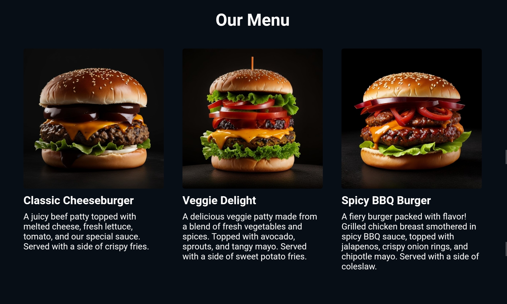
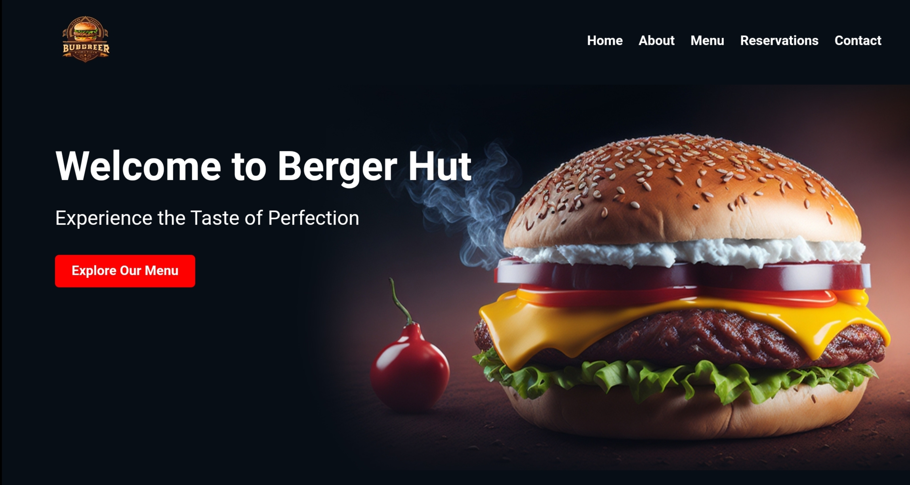

---

# 🍔 BURGER WEBSITE CODSOFT

Welcome to the BURGER WEBSITE CODSOFT! This is a website project where you can explore delicious burgers and make reservations at our burger hut.

## 🚀 Live Demo

Check out the live website here: [BURGER WEBSITE CODSOFT](https://maheshkrsaw.github.io/BURGER-CODSOFT/)

## 📂 Project Structure

Here's a quick overview of the project structure:

```
burger-website/
├── index.html
├── style.css
├── images/
│   ├── iconlogo.png
│   ├── about-image.jpg
│   ├── burger1.jpg
│   ├── burger2.jpg
│   ├── burger3.jpg
│   ├── customer1.jpg
│   ├── customer2.jpg
│   ├── gallery1.jpg
│   ├── gallery2.jpg
│   ├── gallery3.jpg
│   ├── gallery4.jpg
└── README.md
```

## 📜 Features

- 🏠 **Home Section**: Welcome message and navigation links.
- 📖 **About Section**: Information about our burger hut.
- 🍔 **Menu Section**: Explore our delicious menu items.
- 🗓️ **Reservations Section**: Make a reservation online.
- 📸 **Gallery Section**: Browse our photo gallery.
- ✉️ **Contact Section**: Get in touch with us.
- 🌟 **Testimonials Section**: Read what our customers say.

## 📷 Screenshots




## 🛠️ Installation

1. Clone the repository:
    ```bash
    git clone https://github.com/Maheshkrsaw/BURGER-CODSOFT.git
    ```
2. Navigate to the project directory:
    ```bash
    cd BURGER-CODSOFT
    ```
3. Open `index.html` in your browser to view the website.

💼 Project Information
This project was completed as part of an internship at Codesoft. During this internship, I learned and applied various web development skills to create a fully functional and visually appealing burger restaurant website.

About Codesoft Technology
Codesoft Technology is a leading software development company specializing in innovative and cutting-edge technology solutions. With a focus on web development, mobile app development, and custom software solutions, Codesoft Technology is committed to delivering high-quality services to clients across various industries. The internship at Codesoft provided valuable hands-on experience and professional growth opportunities, helping to hone my technical skills and project management abilities.

## 🤝 Contributing

Contributions are welcome! Feel free to submit a pull request or open an issue.

## 📞 Contact

- **GitHub**: [@Maheshkrsaw](https://github.com/Maheshkrsaw)
- **LinkedIn**: [Mahesh Kumar](https://www.linkedin.com/in/mahesh-kumar-256808303?utm_source=share&utm_campaign=share_via&utm_content=profile&utm_medium=android_app)
- **Twitter**: [@maheshkrsaw](https://twitter.com/kumarMahesh9304)
- **Instagram**: [@maheshkrsaw](https://instagram.com/itsmahesh_01)

## 📄 License

This project is licensed under the MIT License. See the [LICENSE](LICENSE) file for details.

---

✨ Enjoy browsing our burger website! 🍔✨

